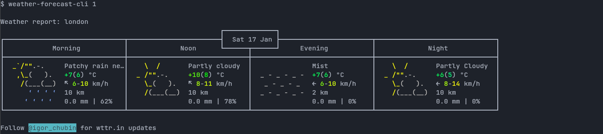

# weather-forecast-cli
The weather forcasting program that runs within command line interface

As chubin mentioned, I use `curl` to preview the forecast. However, what if I just want the specific day forcasting, and save it?
Hence, I've created this bash script. The forecast will be stored in `$HOME/.local/share/` directory, and the script will update when it's time.

## Usage
This program uses only one of two arguments (yet). See those arguments in the script.

```sh
$ ./weather-forecast-cli $anArgument
```


## Credits
1. Thank you for [@igor_chubin](https://github.com/chubin) for creating wttr.in
2. Not forgetting to mention, also thanks for [schachmat](https://github.com/schachmat) for creating [wego](https://github.com/schachmat/wego).
